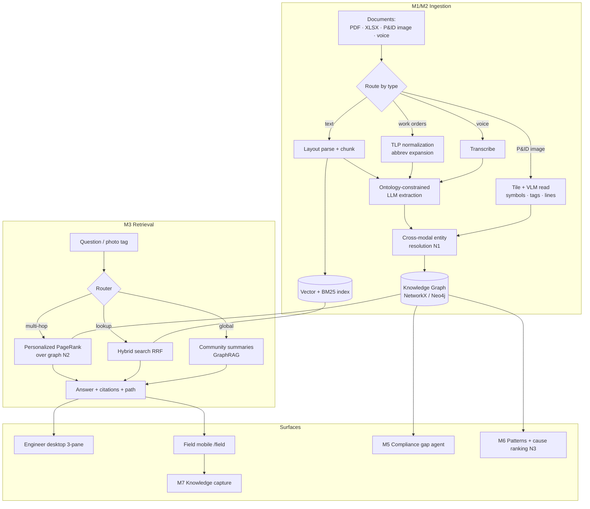

# PlantCortex — Architecture

## System overview

## Key decisions

- **Provenance on every node/edge.** `{doc_id, page, bbox|row|timestamp, extractor,
  confidence}` — powers clickable citations, the audit trail, and cross-modal resolution.
- **Hybrid P&ID, never raw VLM.** Structural line/symbol extraction + VLM tag reading,
  per the 2025–26 benchmark finding that frontier VLMs locate components but fail at
  fine-grained diagram reasoning.
- **PPR *is* the retrieval core**, not a nice-to-have — `networkx.pagerank` with a
  personalization vector seeded from query entities (HippoRAG-style).
- **Embedded-first stores.** NetworkX + embedded vector store are the default so the
  demo has zero external service dependencies. Neo4j/Qdrant are drop-in via the repo
  interfaces (`GraphRepo`, `VectorStore`).

- **Deterministic-first, LLM-optional.** Structured sources (work-order tables, prose with
  known layout, P&ID geometry) use deterministic extraction; the LLM is a *pluggable*
  stage for the messy long tail and answer prose. The whole system runs offline; the LLM
  layers on when a quota'd key is present — nothing on the demo path depends on the network.

## Module map (as built)

| Layer | Module | Responsibility |
|---|---|---|
| Core | `core/ontology.py` | Pydantic node/edge types, `Provenance`, `FailureMode` taxonomy, tag normalization |
| | `core/graph_repo.py` | NetworkX MERGE upsert, linkage metric, **Personalized PageRank** |
| | `core/vector_repo.py` | numpy dense + BM25, RRF hybrid |
| | `core/resolver.py` | cross-modal entity resolution (N1) |
| | `core/llm.py` · `embeddings.py` · `config.py` | Gemini wrapper (cache/retry/throttle), local-first embeddings, settings |
| M1 | `pipelines/m1_ingest/` | parse · tlp · chunk · extract (+ structured fallback) · pipeline |
| M2 | `pipelines/m2_pnid/` | `geometric.py` (OpenCV connectivity) + `vision.py` (VLM) + `pipeline.py` |
| M3 | `pipelines/m3_retrieval/` | router · retrieve (lookup/multihop/global) · communities · answer · engine |
| Agents | `agents/m5_compliance.py` | clause-vs-procedure coverage + evidence PDF |
| | `agents/m6_patterns.py` | pattern cards · causal miner · cause ranking (N3) |
| | `agents/dossier.py` | equipment dossier for the field app |
| API/UI | `api/main.py` | ingest · ask · compliance · patterns · capture · ws; serves `web/` |
| | `web/` | `index.html` desktop 3-pane · `field.html` mobile · `deck.html` pitch |
| Eval | `eval/run.py` + `benchmark_qa.jsonl` | extraction recall · QA 3×3 · time · compliance · linkage → `report.md` |

## Ontology

Single source of truth: [core/ontology.py](core/ontology.py). Node & edge types, the
`FailureMode` code taxonomy (ISO-14224-inspired), and the `Provenance` model are defined
there as Pydantic v2 models and reused by the extractor, resolver, and graph repository.
